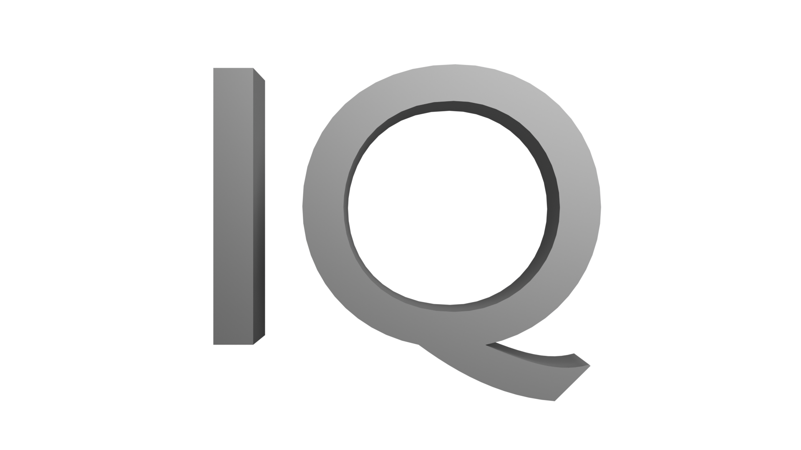

 

 

# **_Intelligent Quantum_**

    
    
    
    
    
    
	 
    
    
    
    

"A Cool Programming Language, in 2026" 
Peharge Projects 2026 
Thank you for your interest in Intelligent Quantum. We greatly appreciate that ❤️  

 

